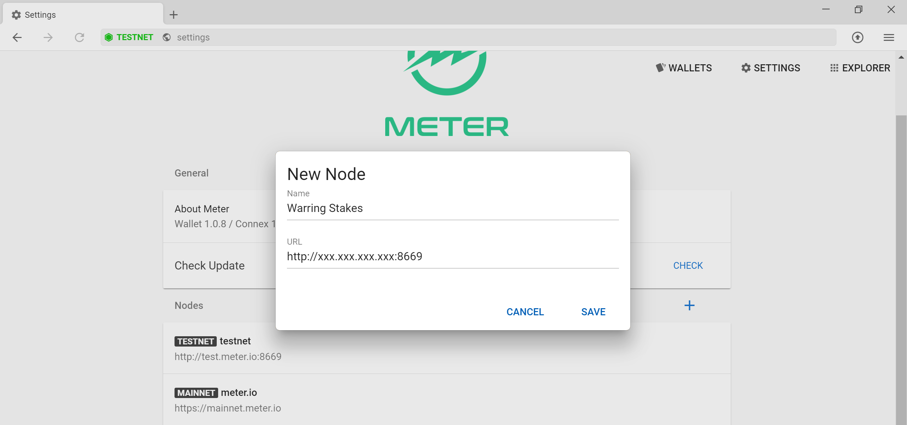
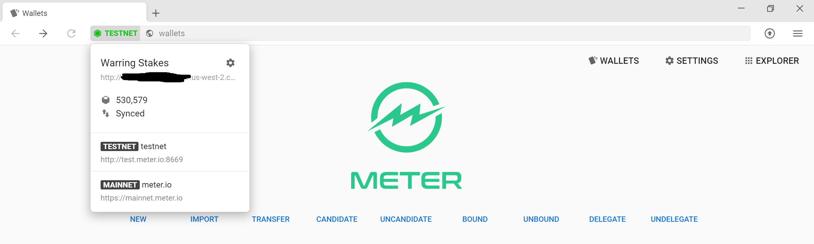

# Instructions for Running on Meter MainNet

# Overview
Meter is a hybrid PoW and PoS blockchain system with dual chain structure.  All the accounts and transactions are recorded on the PoS chain while PoW chain (currently a modified version of Bitcoin starting from the same genesis of Bitcoin) just maintains the crypto puzzles for mining. The PoW chain submits the solutions for the crypto puzzles to the PoS chain and the winning miners receive reward on their accounts on the PoS chain.

Epoch:
Meter operates on epochs, which are signaled by k-blocks (regular blocks are called m-blocks).  At the end of epoch, the committee nodes vote on the longest PoW chain and distribute mining rewards to all the PoW miners, it also pass the information to the PoW chain and all the PoW miners will have to start mining for the stamped PoW block.  To create a k-block, the PoW chain typically has to have more than 60 blocks.  Since the average PoW block period is 1 minute, each epoch is therefore around 1 hour (currently the time for epoch is completely decided by PoW, but we will implement cross interactions for epoch adjustments in the future).  All system financial related activities like reward distribution, entering and exiting the delegate node pool only happens at k-blocks.

It is also required to run both PoS and PoW processes on the same physical or virtual machine to ensure security.

In Meter, there are several types of full nodes in the network:
1. Regular full node: They sync for each block and can support interactions with wallets
2. Delegate nodes: These nodes are candidates for the committee nodes and have opportunity to propose and sign blocks.  To become a delegate node, the top N (N is a protocol parameter) staked full nodes(including both self staking and votes from other stakers) are the delegate nodes.
3. Committee nodes: A random subset of the delegate nodes are selected for every epoch.  These nodes form a committee quorum and perform consensus.  The committee nodes take turns to propose blocks.  If a proposed block receives endorsement signatures from 2/3 of nodes in the committee, the signatures form a QC (Quorum Certificate).  Each newly proposed block carries QC for the previous block.  Once the newly proposed block obtains a QC, the previous block is considered as confirmed and finalized.

In the test net and initial launch of the main net.  The number of Delegate Nodes will be the same as the number of the committee nodes.  In the future, there maybe a subset of nodes with better performance and network connectivity dedicated as the leaders in the committee nodes.


Requirements for running a delegate/committee node:
To achieve the full performance of the Meter network, the recommended hardware configuration is more than 8 compute optimized vCPU, 16GB of memory and 100GB of SSD (AWS c5.2xlarge instance or better).  The maximum block size in Meter is around 1.3MB. It is also recommended to have data center class 1Gbps to 10Gbps internet connection.  However the Meter consensus protocol is capable of adapting to transaction load, network and node processing speed to some extent by varying the block period from 2 sec to up to 30 sec.  The minimum requirement is 2 vCPU and 4GB of memory. When the network has minimum load, the average monthly block data is expected to be about 1.5GB.

# Setting up Docker
Node software is currently provided as docker images.  Please refer to [Ubuntu Docker Installation Guide](https://phoenixnap.com/kb/how-to-install-docker-on-ubuntu-18-04).

By default, if you installed docker through apt install, it requires root user previlige to run.  However, this may introduce security concerns. It is actually pretty simple to run Docker as non-root user.

Setup Docker usergroup to run Docker as non-root user.  We assumed the non-root user that will be running docker is "ubuntu", please change the commands accordingly if you are using a different user.
```
sudo groupadd docker
sudo usermod -aG docker ubuntu
```
After this, please logout and log back in to refresh the user group setting and you will be ready to go.

# Setting up a full node

1. Download the latest [desktop wallet](https://www.meter.io/wallets/)

2. Run Meter full node in container

```
docker run --network host --name meter -e NETWORK="main" -v /home/ubuntu/meter-main:/pos -d meterio/mainnet:latest
```

Several useful commands for docker:

```
docker container ls -a

```
The output will be like the following:
```
CONTAINER ID        IMAGE                      COMMAND                  CREATED             STATUS              PORTS               NAMES
260bbd571d1a        dfinlab/meter-allin   "/usr/bin/supervisord"   23 hours ago        Up 23 hours                             meter
```
```
docker container stop meter              //stop the container
docker container start meter             //start the container
docker container rm meter                //remove the container
docker image ls
docker image rm [image ID]                   //remove the container image, will trigger redownloading the image at the next docker run, it is recommended to do this every time we upgrade the testnet
docker container exec -it meter bash     //launch a bash in the container
```

The log files can be located inside the container, under /var/log/supervisor directory.  If you file any bugs, please remember to attach the logs for PoS (both the stderr and stdout) in the bug. You could either copy and paste the log or use
```
docker cp meter:/var/log/supervisor/[LogFileNameHere]     //replace with the log file name
```

After confirming the node is running properly through the log, you could then connect the desktop wallet to your own full node.

You could compare the with height with the [Explorer](http://scan.meter.io) maintained by the team

4. Point [Meter desktop wallet](https://meter.io/developers) to your own full node
In the settings of the wallet, under node, you could and connect add your own full node by adding http://IPaddrOfYourNode:8669 .  The icon in the left of the address bar should turn green if everything is running properly.  You could use the explorer inside the wallet to look at the status of the block productions. You should also create an account.  Please make sure you keep the mnemonics in a secure location, you will need them to retrieve your account when we switching between mainnet and Testnet.  Please contact a team member to obtain MTRG and MTR test tokens.



